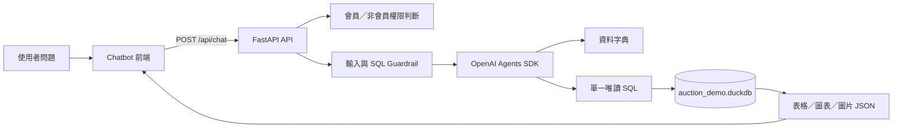

# 鑑｜古玩拍賣研究 Agent

## 1. 專案介紹

本專案是一個面向收藏品與藝術品拍賣資料的自然語言研究助手。使用者可以像對話一樣詢問成交率、年度趨勢、作者表現、拍品排名與圖片；後端 Agent 會讀取資料字典、選擇必要資料表、產生唯讀 SQL，經過 Guardrail 驗證後查詢 DuckDB，再以固定 JSON 結構回傳給前端。

本專案的目標不是展示固定問題範本，而是展示「自然語言問題 → Agent 規劃 → 安全 SQL → 結構化結果」的完整流程。

> 重要揭露：故宮 Open Data 提供品名、類別、年代、尺寸與圖片等收藏品脈絡；拍賣公司、場次、日期、Lot 編號、估價、成交價、幣別與成交狀態是本專案為 Demo 建立的模擬欄位，不代表真實拍賣成交紀錄、行情或投資建議。

---

## 2. 系統架構



### 分析流程

1. 檢查問題是否屬於收藏品／藝術品拍賣範圍。
2. 讀取五張資料表的欄位、型別、合法值、NULL 規則與關聯。
3. Agent 依問題自行選擇資料表與分析方式。
4. 產生單一 `SELECT`／`WITH` 唯讀 SQL。
5. Guardrail 檢查 SQL 是否安全、是否查詢允許的資料表、是否超過方案筆數限制。
6. DuckDB 執行查詢。
7. 回傳固定的 `answer`、`blocks`、`metadata` 與資料揭露資訊。

---

## 3. 資料來源與資料範圍

### 真實來源欄位

- 故宮 Open Data：中文品名、類別、年代、尺寸與圖片網址。
- 香港金融管理局公開資料：歷史匯率來源資料。

來源連結：

- [故宮 Open Data](https://digitalarchive.npm.gov.tw/opendata/)
- [香港金融管理局公開資料](https://api.hkma.gov.hk/public/market-data-and-statistics/)

### 模擬欄位

- 拍賣公司、拍賣場次、日期、地區、Lot 編號。
- 估價、成交價、幣別與成交狀態。

### 模擬資料規則

- 年度：2020–2025。
- 每年 2,500 筆，共 15,000 筆。
- 類別：陶瓷器、銅器、玉器、繪畫、法書，各 3,000 筆。
- 拍賣日期只使用星期六與星期日。
- 成交狀態：成交 80%、流拍 17%、撤拍 3%。
- 幣別：目前統一使用 `RMB`。
- 固定亂數種子：`20200812`，使資料可重現。

### 唯一值與關聯

- `lot_number` 只在同一場次內唯一。
- 業務唯一鍵：`event_id + lot_number`。
- `lot_id` 是跨表與前端追蹤用的技術主鍵。
- 年鑑式輸出可以隱藏 `lot_id`、`event_id`、`auction_house_id`、`artist_name`、`era_name` 與 `attribution_status`。

---

## 4. 資料庫表

資料庫檔案為 `data/auction_demo.duckdb`，以唯讀方式查詢。

| 資料表 | 用途 |
|---|---|
| `auction_lots` | 主要拍品與交易紀錄，15,000 筆 |
| `auction_events` | 拍賣場次、日期、地區與類別 |
| `auction_houses` | 拍賣公司主檔 |
| `name_aliases` | 名稱別名與標準名稱對應 |
| `exchange_rates` | 歷史匯率與資料來源日期 |

完整欄位、型別、合法值、NULL 規則、主鍵與外鍵請參考：

- `data/exports/data_dictionary.csv`
- `data/exports/data_generation_rules.md`

---

## 5. Agent、Skill 與 Guardrail

### Agent

正式模式使用 OpenAI Agents SDK。模型不是直接自由執行資料庫，而是只能透過後端提供的兩個工具：

- `get_dataset_catalog`：取得資料字典。
- `execute_readonly_sql`：執行經過驗證的單一唯讀 SQL。

### Skills

目前工作流包含：

- 分析問題接收
- 查詢規劃
- 視覺敘事
- 分析檢閱
- 儀表板回傳
- 對話上下文

### Guardrail

- 僅允許藝術品拍賣相關問題。
- 擋下 Prompt Injection 與要求 API Key／系統提示的問題。
- 僅允許單一 `SELECT`／`WITH` 查詢。
- 禁止 `DROP`、`DELETE`、`UPDATE`、`INSERT`、外部檔案讀取與外部網路函式。
- 限制可查詢的資料表與結果筆數。
- DuckDB 以 read-only 方式開啟。

---

## 6. 會員方案

前端使用同一個 `/api/chat`，方案由後端依請求標頭判斷；前端不能自行把自己改成會員。

| 權限 | 非會員 | 會員 |
|---|---:|---:|
| 每日問答次數 | 5 | 100 |
| 單次最多回傳筆數 | 10 | 100 |
| 圖表 | 否，趨勢改以表格回傳 | 是 |
| 圖片 | 最多 1 張 | 最多 20 張 |
| 跨資料表分析 | 否 | 是 |
| 對話上下文 | 4 則 | 20 則 |

目前會員身分使用 Demo token；真正接登入、付款或會員資料庫時，只需要替換後端的身分解析邏輯，API 格式不變。管理員方案尚未列入目前 Demo。

模型切換、SQL／Debug 與匯出不作為會員差異。

---

## 7. 技術棧

| 元件 | 用途 |
|---|---|
| FastAPI | 後端 API 與 SSE 串流 |
| OpenAI Agents SDK | Agent 規劃與工具呼叫 |
| DuckDB | 本機唯讀分析資料庫 |
| SQLite | 對話歷史與每日使用量的本機狀態 |
| SQLGlot | SQL 解析與安全檢查 |
| HTML／CSS／JavaScript | 無需建置工具的 Chatbot 前端 |
| Docker Compose | 固定執行環境與交付方式 |

---

## 8. 目錄結構

```text
auction-agent/
├── backend/
│   ├── app/
│   │   ├── agent.py              # Agent 主流程與工具呼叫
│   │   ├── analysis.py            # Mock 分析與 SQL 產生
│   │   ├── auth.py               # 會員身分解析
│   │   ├── data_access.py        # DuckDB 唯讀查詢
│   │   ├── guardrails.py         # 輸入與 SQL Guardrail
│   │   ├── main.py               # FastAPI 端點
│   │   ├── plans.py              # 方案權限與額度
│   │   ├── response_policy.py    # 表格／圖表／圖片回傳策略
│   │   ├── schemas.py            # API JSON schema
│   │   ├── state.py              # 對話與使用量狀態
│   │   └── skills/               # Skill registry
│   ├── requirements.txt
│   ├── requirements-openai.txt
│   └── tests/
├── data/
│   ├── auction_demo.duckdb       # Docker 啟動後直接查詢的資料庫
│   ├── exports/                  # CSV、資料字典、驗證摘要與規則
│   └── raw/                      # 故宮與匯率原始資料
├── frontend/
│   ├── index.html
│   ├── app.js
│   └── styles.css
├── scripts/                     # 資料產生與文件產生工具
├── requirements.txt             # 資料重建工具的 DuckDB 依賴
├── Dockerfile
├── docker-compose.yml
├── .env.example
├── .gitignore
└── .dockerignore
```

---

## 9. Docker 啟動

### 環境需求

- Docker Desktop。
- Windows 使用 Docker Desktop 時需啟用 WSL 2／硬體虛擬化。
- 不需要在主機安裝 Python 或 DuckDB。

### 步驟一：Clone 專案

```powershell
git clone https://github.com/mkz0128/ai_practitioner_program.git
cd ai_practitioner_program
```

### 步驟二：建立環境變數

```powershell
Copy-Item .env.example .env
```

在 `.env` 填入後端使用的 API Key：

```env
AUCTION_AGENT_MODE=openai
OPENAI_MODEL=gpt-5.5
OPENAI_API_KEY=your-api-key
DEMO_MEMBER_TOKEN=your-local-member-token
```

`.env` 只放在本機，絕對不要提交到 GitHub。API Key 不會由前端取得。

若只要離線測試資料與介面，可以使用：

```env
AUCTION_AGENT_MODE=mock
```

### 步驟三：啟動

```powershell
docker compose up --build -d
```

### 步驟四：開啟服務

- Chatbot：<http://127.0.0.1:8000/ui/>
- Swagger：<http://127.0.0.1:8000/docs>
- 健康檢查：<http://127.0.0.1:8000/health>

### 停止服務

```powershell
docker compose down
```

對話紀錄與每日使用量存在 Docker volume，不會寫回 GitHub 專案。

---

## 10. API 文件

### 主要端點

| 方法 | 端點 | 用途 |
|---|---|---|
| `POST` | `/api/chat` | 主要問答端點 |
| `GET` | `/api/me` | 取得目前方案與今日額度 |
| `GET` | `/health` | 確認服務與資料庫狀態 |
| `GET` | `/api/catalog` | 取得安全資料字典摘要 |
| `GET` | `/api/skills` | 取得可用 Skill 清單 |

`/api/models` 與 `/api/model` 目前保留給內部開發測試；前端問答不需要依賴它們，也不屬於會員方案差異。

### `/api/chat` 請求

```json
{
  "message": "2020 到 2025 年每年的成交率趨勢？",
  "conversation_id": null,
  "mode": "normal",
  "stream": false
}
```

會員請求加上：

```http
Authorization: Bearer <DEMO_MEMBER_TOKEN>
```

非會員可帶匿名識別，讓每日額度與裝置保持一致：

```http
X-Anonymous-Id: <frontend-generated-id>
```

### `/api/chat` 回傳結構

```json
{
  "schema_version": "1.0",
  "conversation_id": "conv_xxx",
  "answer": "2021 年成交率最高。",
  "blocks": [
    {
      "id": "table_1",
      "type": "table",
      "title": "查詢結果",
      "data": {
        "columns": [],
        "rows": [],
        "row_count": 6
      }
    }
  ],
  "metadata": {
    "plan": "guest",
    "plan_label": "非會員",
    "usage_remaining_today": 4,
    "presentation": {
      "table": true,
      "chart": false,
      "images": false
    }
  },
  "error": null
}
```

`blocks[].type` 是前端固定渲染契約：

- `table`：表格資料。
- `chart`：圖表規格與自帶資料列，前端可使用 CSS、ECharts 或其他 renderer。
- `image`：拍品圖片與來源資訊。
- `kpi`：單一指標卡片。

前端不需要解析模型輸出的 Markdown 或自由格式 ECharts。正常模式只需處理 `answer`、`blocks`、`metadata` 與 `error`；分析步驟只在 Debug 模式使用。

### `/api/me` 回傳範例

```json
{
  "user_id": "guest:browser-id",
  "authenticated": false,
  "plan": {
    "id": "guest",
    "label": "非會員",
    "used_today": 1,
    "daily_limit": 5,
    "remaining_today": 4,
    "entitlements": {
      "max_rows": 10,
      "charts": false,
      "images": true,
      "max_images": 1,
      "cross_table": false,
      "history_messages": 4
    }
  }
}
```

### SSE 串流

將 `stream` 設為 `true` 時，前端會收到：

1. `message_start`
2. 多個 `trace`
3. 一個完整的 `result`
4. `done`

---

## 11. 驗證與測試

- `backend/tests/test_smoke.py`：Guardrail、Mock Agent、資料字典與 API 基本測試。
- `GET /health`：確認服務、資料庫與五張資料表存在。
- `GET /api/me`：確認非會員／會員方案解析。
- Docker 啟動後可從 `/docs` 執行 API 測試。
- 會員與非會員使用相同 `/api/chat`，但回傳筆數、圖表、圖片數量與跨表權限由後端強制限制。

---

## 12. 限制與後續工作

- 拍賣交易欄位為模擬資料，不可解讀為真實成交行情。
- 目前會員身分是 Demo token，不是正式登入或付款系統。
- 管理員方案尚未建立。
- `auction_demo.duckdb` 適合 Demo 與本機分析；正式上線時可替換成正式資料庫，API 契約維持不變。
- 若前端與後端分開部署，需要設定公開 HTTPS API URL 與 `AUCTION_ALLOWED_ORIGINS`。
- GitHub 儲存的是程式與 Demo 資料，不儲存 API Key、會員 token 或使用者對話狀態。

---

## 13. 前後端交接方式

### 後端負責

- Agent、SQL、DuckDB、Guardrail、會員方案與 API 回傳格式。
- 後續會員／管理員規則都在後端修改。
- API endpoint 與 JSON 結構盡量保持穩定。

### 前端負責

- 呼叫 `/api/chat` 與 `/api/me`。
- 依 `blocks` 的 `type` 決定顯示表格、圖表或圖片。
- 不在前端自行判斷權限，也不儲存 OpenAI API Key。

標準協作流程：後端 push 更新 → 前端 `git pull` → `docker compose up --build -d` → 重新測試 API。
